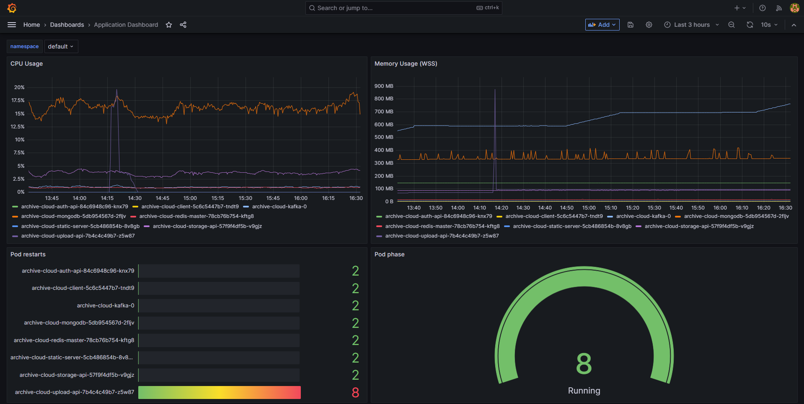

# Grafana & Prometheus

---

## Dashboard view

## Prometheus queries

**1. CPU Usage**

> `sum by (cluster, namespace, pod, container) (

          rate(container_cpu_usage_seconds_total{job="kubelet", metrics_path="/metrics/cadvisor", container!="POD", namespace="$namespace"}[5m])
        ) * on (cluster, namespace, pod) group_left(node) topk by (cluster, namespace, pod) (
          1, max by(cluster, namespace, pod, node) (kube_pod_info{node!=""})
        )`

**2. Memory usage**

> `sum(container_memory_working_set_bytes{job="kubelet", metrics_path="/metrics/cadvisor", namespace="$namespace"}) by (pod)`

**3. Pod restarts**

> `kube_pod_container_status_restarts_total{namespace="$namespace"}`

**4. Pod running**

> `count by (phase) (kube_pod_status_phase{namespace="$namespace", phase="Running"} == 1) `
